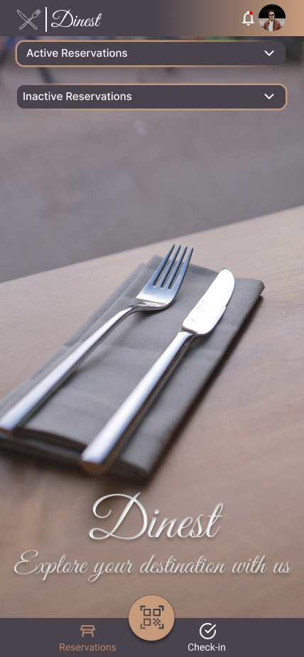
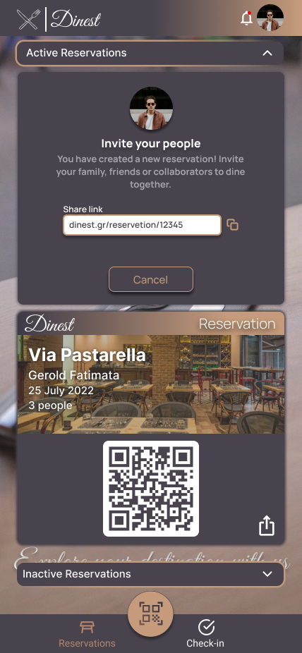

# Dinest
A sophisticated restaurant table reservation system design using Figma Tool

## Introduction

An intuitive restaurant reservation application designed for seamless user experience. Leveraging location-based services, users can efficiently browse and book reservations at a variety of restaurants. Deployable across both mobile and desktop platforms, the application was developed as part of the HY 364 course, incorporating principles of user interface design and usability testing. The design has been developed with Lo-Fi and Hi-Fi style.

## Features

- Browse through a list of restaurants
- View restaurant details, including location, contact information, and opening hours
- Explore restaurant menus and special offers
- Leave a review about your experience on the restaurant
- Make a reservation for a specific date and time
- Edit or cancel your reservation
- Receive confirmation and reminders for upcoming reservations

## Lo - Fi Smarthphone Samples

    
    
    
    
    
    

## Hi - Fi Smarthphone Samples

    
    

## Contributing

Contributions are welcome! If you have any suggestions or improvements for the Restaurant Reservation App, please submit a pull request. For major changes, please open an issue first to discuss the proposed changes.

## License

This project is licensed under the [MIT License](LICENSE).
